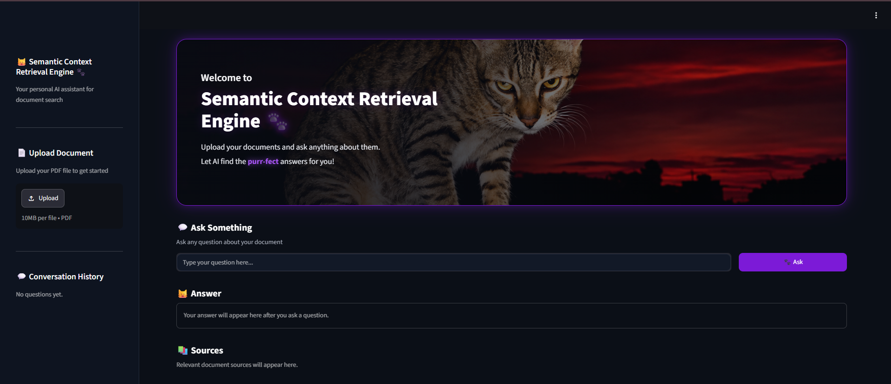
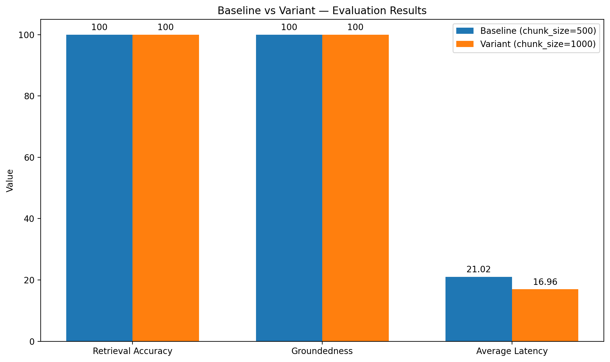

# Semantic Context Retrieval Engine


A FastAPI backend that lets users upload PDF documents, extract their text, generate embeddings, retrieve relevant chunks via ChromaDB, and produce grounded, source-cited answers using the Gemini API. Built as a Retrieval-Augmented Generation (RAG) pipeline for private document Q&A.

## Live Demo

[https://semantic-context-retrieval-engine.onrender.com](https://semantic-context-retrieval-engine.onrender.com)

---

## Project Screenshot



---

## Table of Contents

- [Live Demo](#live-demo)
- [Project Screenshot](#project-screenshot)
- [Overview](#overview)
- [Features](#features)
- [Tech Stack](#tech-stack)
- [Architecture / Query Flow](#architecture--query-flow)
- [Project Structure](#project-structure)
- [Setup](#setup)
- [API Endpoints](#api-endpoints)
- [Error Handling](#error-handling)
- [Testing](#testing)
- [Evaluation](#evaluation)
- [Limitations & Future Work](#limitations--future-work)

---

## Overview

Documents are uploaded, parsed, and split into chunks, which are embedded and stored in a vector database. At query time, the system retrieves the most relevant chunks for a user's question and passes them as context to Gemini, which generates an answer grounded strictly in the retrieved content — along with references back to the exact file, page, and chunk the answer came from.

## Features

- PDF upload (max 10 MB)
- PDF text extraction
- Page-based chunking
- Gemini embeddings
- ChromaDB vector storage and similarity search
- Document-specific or all-document querying
- Gemini-based grounded answer generation
- Source references with file ID, page number, and chunk ID
- Document listing
- Error handling for invalid PDFs, empty questions, and missing documents

## Tech Stack

| Layer | Technology |
|---|---|
| API framework | FastAPI |
| Validation / config | Pydantic, Pydantic Settings |
| Database / ORM | SQLAlchemy + SQLite |
| PDF parsing | pdfplumber |
| Embeddings & generation | Google Gemini API |
| Vector store | ChromaDB |
| Language | Python |

## Architecture / Query Flow


```
Question
   ↓
Question Embedding
   ↓
ChromaDB Similarity Search
   ↓
Relevant Chunks
   ↓
Context Assembly
   ↓
Gemini (grounded generation)
   ↓
Answer + Sources
```

The LLM is explicitly instructed to answer only from retrieved context. If the answer isn't supported by the document, the API returns:

```
The answer was not found in the document.
```

## Project Structure

```
PERSONAL-DOCUMENT-SEARCH/
├── .streamlit/
│   └── config.toml
├── app/
│   ├── database/
│   ├── routes/
│   ├── schemas/
│   ├── services/
│   ├── utils/
│   └── main.py
├── assets/
│   └── cat_hero.png
├── app.py
├── uploads/
├── chroma_db/
├── .env
├── requirements.txt
└── README.md
```

## Setup

```bash
python -m venv .venv
```

Windows PowerShell:

```bash
.venv\Scripts\Activate.ps1
```

Install dependencies:

```bash
pip install -r requirements.txt
```

Create a `.env` file in the project root:

```
GEMINI_API_KEY=your_gemini_api_key
DATABASE_URL=your_database_url
```

> Do not commit `.env` or API keys to GitHub.

Run the server:

```bash
uvicorn app.main:app --reload
```

Interactive docs (Swagger UI):

```
http://127.0.0.1:8000/docs
```

## API Endpoints

### Upload PDF

```
POST /upload
```

Uploads and processes a PDF.

**Response:**

```json
{
  "file_id": "document-id",
  "filename": "example.pdf",
  "status": "ready"
}
```

### Query Documents

```
POST /query
```

**Request:**

```json
{
  "question": "What is this document about?",
  "file_id": "optional-file-id"
}
```

`file_id` is optional — if provided, retrieval is restricted to that document.

**Response contains:**

- `answer`
- `sources`
  - `file_id`
  - `page_number`
  - `chunk_id`

### List Documents

```
GET /documents
```

Returns uploaded documents with `file_id`, `filename`, `page_count`, and `status`.

## Error Handling

| Condition | Behavior |
|---|---|
| Non-PDF upload | `400` |
| PDF larger than 10 MB | `400` |
| PDF with no extractable text | `400`, document status → `failed` |
| Empty question | `400` |
| Unknown `file_id` | `404` |
| Unexpected document-processing error | `500`, document status → `failed` |

## Testing

Manually tested through the FastAPI Swagger UI, covering:

- Successful PDF upload
- PDF extraction failure
- Chunk creation
- Embedding generation
- ChromaDB storage
- Similarity retrieval (file-specific and cross-document)
- Query without `file_id`
- Gemini answer generation
- Grounded and out-of-context answers
- Empty question handling
- Invalid `file_id`
- Document listing
- Successful upload after error-handling changes

## Evaluation

To measure retrieval quality and answer grounding rather than relying on general impressions, a controlled evaluation was run against the pipeline.

**Setup:**
- 18 hand-written questions across 3 source PDFs: *Clash of Clans Overview*, *Indian Air Force Aircraft Fleet Overview*, and *How Large Language Models Work*.
- Question mix included easy (direct fact lookup), moderate (multi-detail), and trap questions (answers not present in the document, to test refusal behavior) to test both recall and grounding discipline.
- A controlled, single-variable experiment compared the baseline chunk size (**500 characters**) against a variant (**1000 characters**), with all other pipeline parameters held constant.

**Results:**

| Metric | Baseline (`chunk_size=500`) | Variant (`chunk_size=1000`) |
|---|---:|---:|
| Retrieval Accuracy | 100% | 100% |
| Groundedness | 100% | 100% |
| Average Latency | 21.02 sec | 16.96 sec |



**Takeaway:**

Increasing chunk size from 500 to 1000 characters did not change retrieval accuracy or answer groundedness on this evaluation set — both stayed at 100%, including correct refusals on trap questions where the answer wasn't in the document. The 1000-character variant showed lower measured average latency (16.96s vs 21.02s), a **19.3% lower measured latency** on this evaluation run; however, latency varied noticeably across individual queries, so this difference should not be interpreted as a guaranteed latency improvement or a claim that the system is universally faster.

## Limitations & Future Work

- **Evaluation scale**: The current test set (18 questions, 3 documents) is small enough that 100% retrieval accuracy and groundedness should be read as *"no failures observed on this test set,"* not as a general accuracy guarantee. A larger, more adversarial question set (50–100+ questions, more trap/edge cases) would give more statistically meaningful numbers.
- **Latency variance**: Per-query latency wasn't broken down by cause (embedding call vs. retrieval vs. Gemini generation), so it isn't yet clear how much of the improvement is chunk-size-driven vs. API variance. Instrumenting latency per pipeline stage would clarify this.
- **Automated evaluation harness**: Evaluation was run manually; a scripted eval harness (question set + expected chunk/answer + automatic scoring) would make it easy to re-run this comparison whenever chunking, embedding, or prompt strategy changes.
